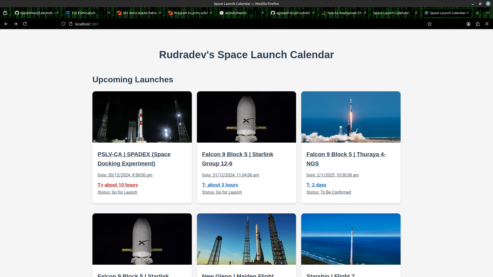
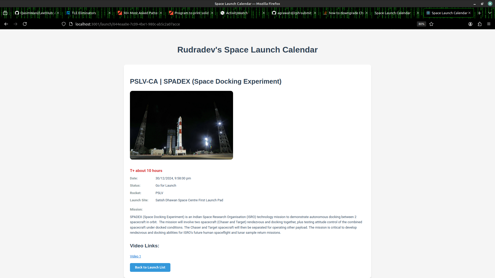

# Everyday Series Problem Statement

Assignment
Propose a MicroSaaS Idea
- Think of a very simple MicroSaaS idea addressing a niche market or a specific problem. The idea should be practical and feasible for a one-person startup.
    Example Ideas:
 	- “Meeting Time Optimizer”: 
	- “Content Expiry Notifier”: 
	- “Social Media Hashtag Generator”: 

Create a GitHub Repository
Include:
- A README.md file with the following:
- Project description
- Setup instructions
- Features overview
- Screenshots (if applicable)
- Basic implementation of the idea (use any programming language or framework of your choice).
- You may use ChatGPT or other resources for assistance, but your repository should reflect your understanding of the work.

Evaluation Criteria
- Clarity of the Idea: How well does the proposed MicroSaaS solve the problem?
- Code Quality: Is the implementation clean, functional, and organized?
- Documentation: Is the README clear and comprehensive?
- Innovation and Feasibility: Is the idea innovative and simple enough for a one-person startup?

# Rudradev's Space Launch Calendar

Space Launch Calendar is a web application that provides up-to-date information on upcoming space launches worldwide. It offers a user-friendly interface to browse launch details, countdown timers, and mission information.

## Features

- [x] View a list of upcoming space launches 
- [x] Detailed information for each launch, including:
  - [x] Launch date and time
  - [x] Countdown timer (T- for upcoming, T+ for past launches)
  - [x] Mission description
  - [x] Rocket information
  - [x] Launch site details
- [x] Responsive design for desktop and mobile devices
- [x] Real-time updates of countdown timers
- [x] Links to video streams (when available) (rate limited by the SpaceDevs API to 15req/hour)

## Setup Instructions

1. Clone the repository:
`git clone https://github.com/RudradevArya/EverydaySeries-OA.git` 
`cd space-launch-calendar`

2. Install dependencies:
`npm install`

3. Create a `.env` file in the root directory and add your Space Devs API key (if using the Paid API key):
`REACT_APP_SPACE_DEVS_API_KEY=your_api_key`

4. Start the development server:
`npm start`

5. Open your browser and visit `http://localhost:3000`

## Screenshots

### Launch List

### Launch Details

## Task List for Future Enhancements

- [ ] Integrate with my LambdaMailer project for email notifications
- [ ] Implement push notifications for upcoming launches
- [ ] Implement user authentication
- [ ] Add feature to save favorite launches
- [ ] Create a calendar view of launches
- [ ] Add search functionality
- [ ] Create a dark mode option

